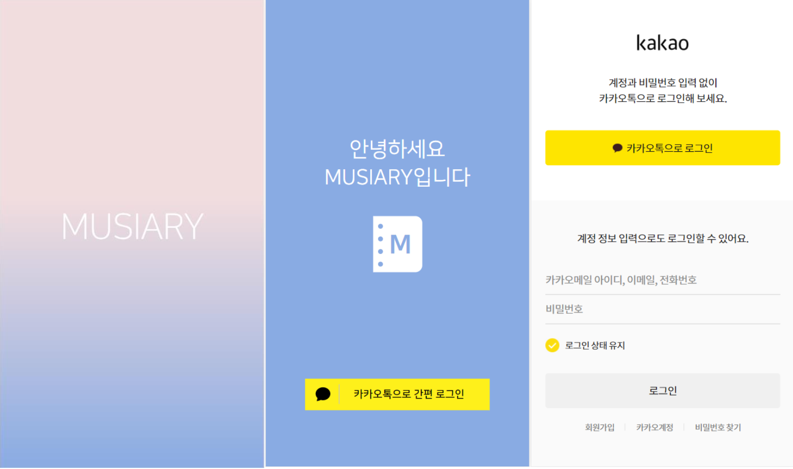
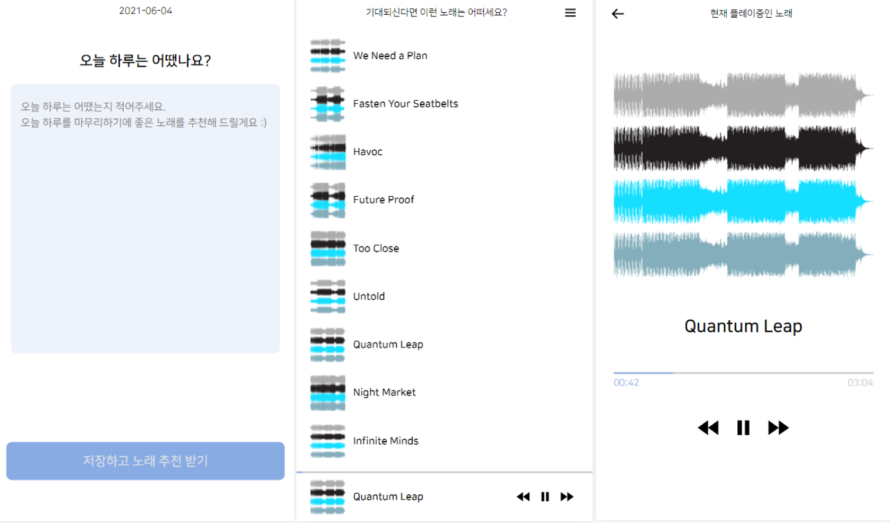
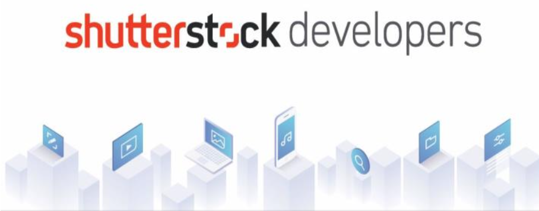
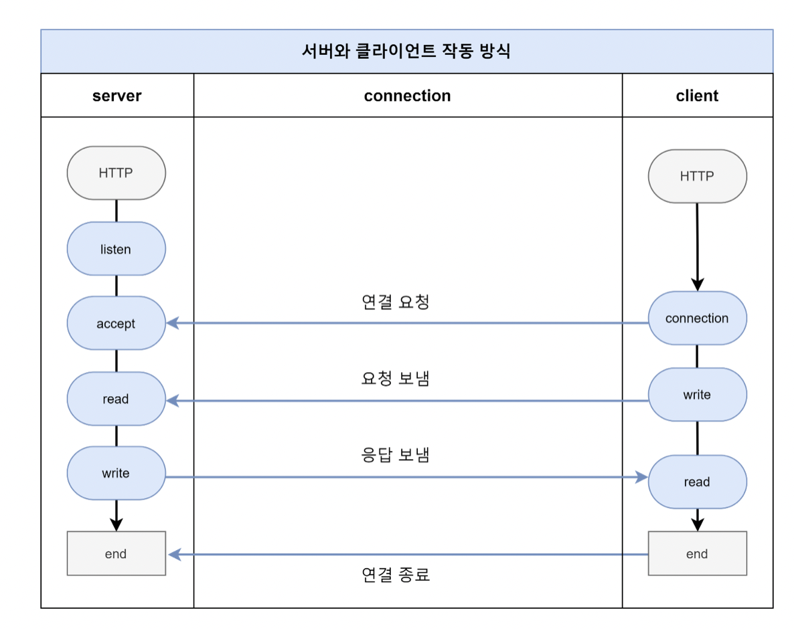
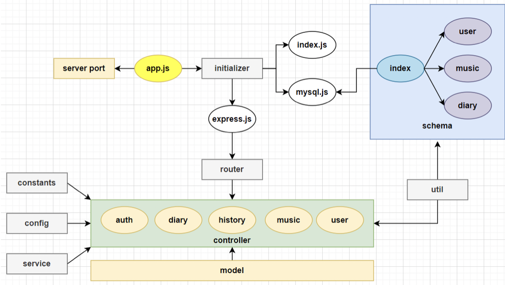
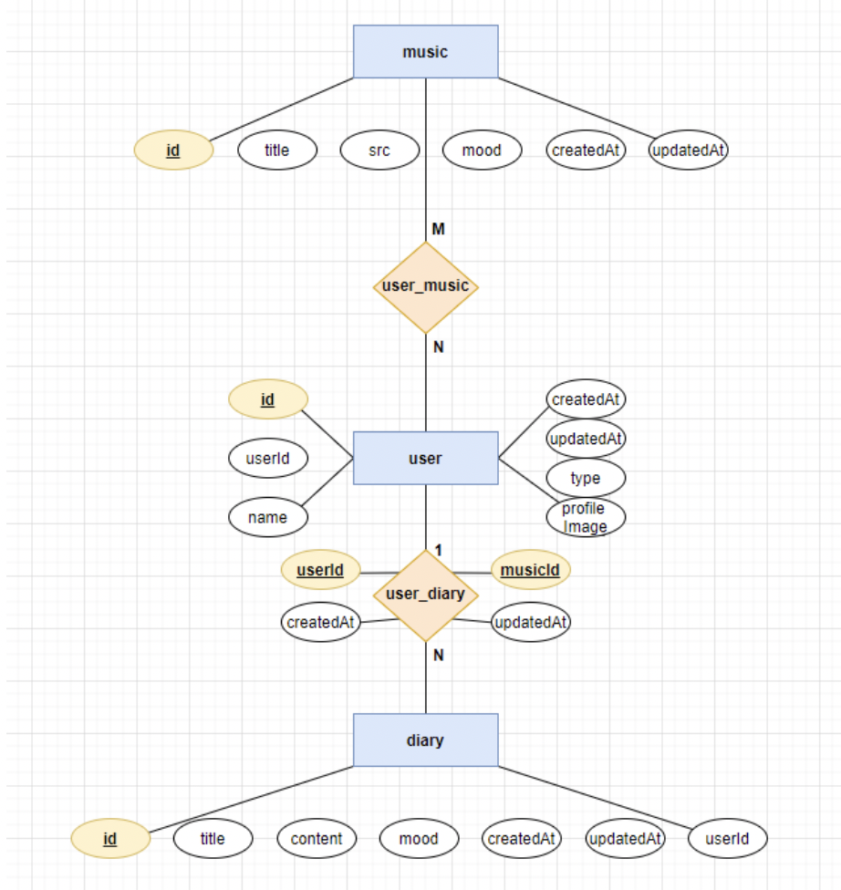
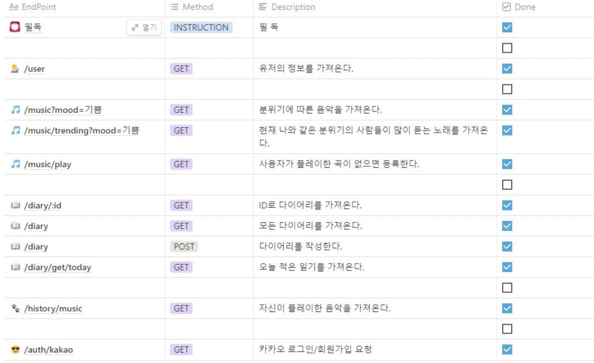
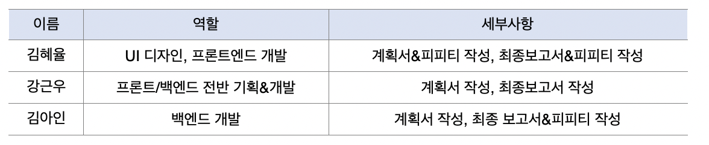

# 오픈SW개론 프로젝트 [Musiary]

## 0. 프로젝트 수행원

### 0-1. 팀장

1. 소프트웨어학과 17013234 김혜율

### 0-2. 팀원

1. 소프트웨어학과 15011125 강근우
2. 소프트웨어학과 17013233 김아인

## 1. 프로그램 개요와 의도

> 이 애플리케이션은 Music과 Diary를 합친 MUSIARY라는 이름으로, 일기에 들어가 있는 감정을 인공지능으로 분석해 사용자의 감정을 알아차려 현재 감정과 그 날의 기분에 맞는 노래를 추천해주는 웹앱(Web App)이다.

> 다이어리와 음악을 결합시켜서 사용자들의 감정을 충족시킬 수 있는 웹앱을 만드는 것이 이 프로그램의 기획 의도이다.

## 2. 개발 환경

### 1) 언어:

- JavaScript

### 2) 운영체제:

- Windows, Mac OS

### 3) 사용 툴:

- Node.js
- Express
- React
- AI cloud
- ShutterStock Music API

**Node.js**

Node.js는 Chrome V8 Javascript 엔진으로 빌드된 Javascript 런타임이다.

- 링크: https://perfectacle.github.io/2017/06/18/what-is-node-js/

**Express**

Node.js를 위한 빠르고 개방적인 간결한 웹 프레임워크이다.

- 링크: https://expressjs.com/ko/

**React**

사용자 인터페이스를 만들기 위한 JavaScript 라이브러리이다.

- 링크: https://ko.reactjs.org/

**AI cloud**

주어진 한국어 문장, 문서에 대한 감성과 다중 감정을 추론하는 API이다.

- 링크: https://www.saltlux.ai/portal/api_detail?id=category14

**Shutter Stock Musci API**

감정을 기반으로 노래를 추천해주는 API이다.

- 링크: https://www.shutterstock.com/developers/documentation

## 3. Server와 Client 작동 방식

Musiary 웹앱은 서버 클라이언트 시스템으로 클라이언트가 서버에 자원을 저장하고 필요할 때마다 가져다 쓰는 방식으로 작동한다.

HTTP 통신 방식으로 클라이언트가 요청을 보낼 때마다 Server가 응답을 하는 통신이다.

### 3-1. 서버

클라이언트의 연결 요청을 대기하고 요청이 오면 요청을 받아들이고 해당 요청에 대한 응답을 보낸다.

### 3-2. 클라이언트

서버에게 필요한 요청을 하고 서버에서 응답이 오면 응답에 대한 처리를 한다.

## 4. 백엔드

### 4-1. 구조

1. App.js

- 서버를 실행하면 App.js에서 서버를 port와 연결하여 시작한다.

2. Initializer

- Initializer폴더는 index.js에서 express 초기화하고 라우터 폴더로 라우팅 한다. mysql.js에서는 schema폴더와 함께 sequelize를 통해 데이터베이스 초기화 등 기본적인 서버 연결의 준비를 한다.

3. schema

- 데이터베이스에서 사용하는 schema들을 정의한다.

4. util

- 서버를 구축할 때 필요한 기능과 메소드 등의 정보들을 모아 놓은 폴더이다. 필요 할 때마다 이 폴더에서 데이터들을 꺼내 쓸 수 있다.

5. router

- controller폴더에 들어 있는 diary, music, history, user에 대한 콜백함수와 연결하여 라우팅 경로를 설정한다.

6. controller

- model폴더에 있는 sequelize query문을 참조해 콜백함수들을 기능별로 나눠서 정의한다.

7. model

- 기능에 따라 필요한 query 함수들을 만들기 위해 sequelize를 이용하여 mysql의 query문을 작성한다.

8. constants

- 클라이언트 response에 필요한 response message와 statusCode가 들어있다.

9. config
   카카오나 JSON Web Token에 대한 속성을 관리한다.

10. service

- 카카오에 사용자 정보 등에 대한 서비스 요청을 할 수 있다.

### 4-2. DB 설계

### 1. DB 테이블 설계

;

### 2. 테이블 속성과 관계

- music 테이블

  속성: id, title, src, mood, createdAt, updatedAt

  primary key: id

  내용: music에 대한 정보를 id로 구분하고 music의 제목과 src, 해당 music의 분위기에 대한 정보를 저장한다. 그리고 music을 table에 등록한 날짜와 새로 업데이트한 날짜를 저장한다.

  관계: user 테이블과 다대다 관계를 맺는다.

- user 테이블

  속성: id, userId, name, createdAt, updatedAt, type, profile Image

  primary key: id

  내용: user에 대한 정보를 id로 구분하고 user의 이름, type, profile Image와 userId를 저장한다. 그리고 user을 table에 등록한 날짜와 새로 업데이트한 날짜를 저장한다.

  관계: music 테이블과 다대다 관계를 맺고 diary 테이블과 일대다 관계를 맺는다.

- diary 테이블

  속성: id, title, content, mood, createdAt, updatedAt, userId

  primary key: id

  내용: diary에 대한 정보를 id로 구분하고 diary의 제목과 내용, 해당 diary의 분위기에 대한 정보를 저장한다. 그리고 music을 table에 등록한 날짜와 새로 업데이트한 날짜를 저장하고 userId를 따로 저장해 어떤 user가 쓴 다이어리인지 저장한다.

  관계: user 테이블과 다대일 관계를 맺는다.

### 4-3. API Docs

서버에서 프론트에게 직접적으로 제공해주는 핵심 API기능들이다. REST API 규칙을 기반으로 endpoint에 콜백함수의 경로를 설정한다.

## 5. 프론트 엔드

### 5-1. 구조

1. App.jsx

   모든 사용자는 App.jsx로 먼저 접근한다.

2. Auth.jsx

   사용자의 접근 경로에 따라 이에 부합하는 페이지로 이동시켜 주기 전에 Auth.jsx를 거친다.  
   Auth.jsx에서 로그인이 되어있는지를 체크한다. 만약 로그인이 되어있지 않다면, 강제로 로그인 페이지로 리다이렉트 시켜 인증을 강제한다.
   로그인이 되어있을 시에만 사용자는 페이지에 접근할 수 있다.

3. Pages 폴더

   각각의 페이지는 여러 개의 컴포넌트로 이루어져 있다.

4. Components 폴더

   각각의 컴포넌트는 재활용이 가능한 UI 요소이다. 이 컴포넌트들을 조합해서 페이지를 만든다.

5. Asset 폴더

   컴포넌트를 구성하는데 필요한 사진, 아이콘 등등은 Asset 폴더에 존재한다.

6. Util 폴더

   컴포넌트를 구성하는데 필요한 유틸 성격이 강한 함수들은 Util 폴더에 존재한다.

7. Context 폴더

   Audio는 모든 페이지에서 실행이 되어야 하기 때문에 Context 폴더에 전역 싱글턴 객체로 존재한다.

8. Hook 폴더

   useAudio.js 커스텀 훅에서 Audio 객체를 이용한 여러가지 기능을 함수로 묶은 커스텀 훅을 만들어 여러 컴포넌트에서 사용하고 있다.

## 6. 협업 수단

Github  
https://github.com/HyeyulKim/OpenSource_Team13

Notion  
https://www.notion.so/SW-7d66b511d2eb41c39754df62ac83cf0f

## 7. 팀원 기여도

